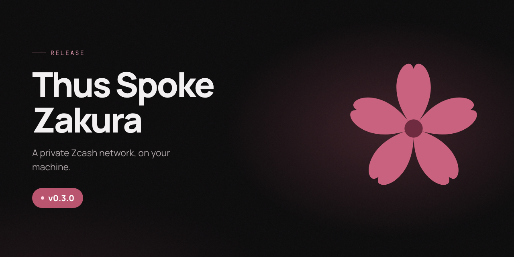

# Changelog

For earlier releases, see [GitHub Releases](https://github.com/zcashlabs/thus-spoke-zakura/releases).

## Unreleased

## v0.3.0

This release brings Ironwood to the local Zcash Regtest environment, adds wallet
transfers from `ths`, and improves mining progress and payment recovery. It also
changes API values and runtime resource names.

### Action required

- **Fresh Regtest instance:** The new launcher uses `ths-*` Docker resources
  instead of `tsz-*` and does not migrate an existing chain or wallet. Save
  anything you need before stopping the old instance: stopping deletes its
  chain, wallet, keys, and volumes. Once v0.3.0 is published, official v0.2.1
  users can stop their instance, run `ths update`, and start a fresh one.
  Source-build users need to rebuild or reinstall.
  [#125](https://github.com/zcashlabs/thus-spoke-zakura/pull/125)
- **API migration:** Use `ironwood` instead of `orchard` for pool values, and
  read `ironwood_zatoshi` instead of `orchard_zatoshi` from `/api/v1/accounts`.
  Requests specifying the old `orchard` pool are rejected.
  [#124](https://github.com/zcashlabs/thus-spoke-zakura/pull/124),
  [#126](https://github.com/zcashlabs/thus-spoke-zakura/pull/126)
- **Configuration migration:** Rename custom `TSZ_*` installer, updater,
  server, and development settings to `THS_*`. Browser settings and Docker
  resources using the old names are not migrated automatically.
  [#125](https://github.com/zcashlabs/thus-spoke-zakura/pull/125)
- **Endpoint changes:** The default dashboard, Zakura RPC, P2P, and lightwalletd
  host ports are now `32805`, `18232`, `18233`, and `9067`, bound to
  `127.0.0.1`. Use `ths start --port-offset 10` for another instance. Startup
  reports an occupied port instead of choosing a different one.
  [#72](https://github.com/zcashlabs/thus-spoke-zakura/pull/72)
- **Development addresses:** Fresh instances derive their accounts from a
  fixed, public mnemonic, so addresses are repeatable. Addresses from older,
  randomly seeded instances should not be assumed to match. Never send real
  funds to these Regtest accounts.
  [#103](https://github.com/zcashlabs/thus-spoke-zakura/pull/103),
  [#104](https://github.com/zcashlabs/thus-spoke-zakura/pull/104),
  [#120](https://github.com/zcashlabs/thus-spoke-zakura/pull/120)

### Highlights

- **Ironwood support:** New Regtest chains activate NU6.1, NU6.2, and NU6.3 at
  height 1. The environment uses Zakura 1.6.0 and the updated Zakura wallet
  stack. Shielded wallet operations use Ironwood, and the explorer displays
  Ironwood actions and roots.
  [#124](https://github.com/zcashlabs/thus-spoke-zakura/pull/124),
  [#126](https://github.com/zcashlabs/thus-spoke-zakura/pull/126)
- **Wallet commands:** `ths wallet faucet`, `send`, `shield`, and `unshield`
  operate on development accounts 1–5. Sends to Ironwood can include an
  encrypted memo of up to 512 bytes. A transfer may use the same source and
  destination account when the pools differ; sending back to the same account
  and pool is rejected.
  [#81](https://github.com/zcashlabs/thus-spoke-zakura/pull/81),
  [#138](https://github.com/zcashlabs/thus-spoke-zakura/pull/138)
- **Fee-aware sending:** The dashboard quotes the fee before sending and offers
  a **Max** button that leaves room for it. An unaffordable send returns HTTP
  422 with the required and available amounts.
  [#97](https://github.com/zcashlabs/thus-spoke-zakura/pull/97)
- **Mining progress across tabs:** Mining runs as a server-owned job, allowing
  the dashboard to restore progress after navigation, refresh, or closing and
  reopening the tab. `ths mine` still waits for completion. An admitted job
  continues if the CLI client times out; check its status before requesting
  another. Job history lasts for the server process and is discarded when it
  stops. [#139](https://github.com/zcashlabs/thus-spoke-zakura/pull/139)
- **Viewing key export:** `/api/v1/accounts` includes unified full viewing keys
  for user accounts 1–5. It does not expose the treasury account or spending
  keys. [#80](https://github.com/zcashlabs/thus-spoke-zakura/pull/80)

### Reliability and performance

- **Payment retries:** The server reserves idempotency keys before payment side
  effects and recovers prepared transactions across retries and restarts.
  Reusing a key with different payment parameters is rejected.
  [#71](https://github.com/zcashlabs/thus-spoke-zakura/pull/71)
- **Activity confirmation:** Payments are marked confirmed from chain evidence.
  Pending activity is reconciled after synchronization, startup, mining trouble,
  and retries. [#69](https://github.com/zcashlabs/thus-spoke-zakura/pull/69)
- **Scalable treasury synchronization:** The treasury is also the mining
  address, so every mined block adds another transparent output. Previously,
  routine wallet sync repeatedly loaded the treasury's entire unspent output
  set, making sync more expensive as the chain grew. Routine sync now refreshes
  transparent outputs for user accounts 1–5; when the faucet needs funds, it
  discovers treasury rewards block by block using a saved cursor. Reward
  imports and cursor updates commit together and rewind on a chain
  reorganization. Shielded scanning still covers all accounts, and the mining
  and faucet APIs are unchanged.
  [#114](https://github.com/zcashlabs/thus-spoke-zakura/pull/114)
- **Service timeouts:** Ordinary Zakura RPC calls and lightwalletd broadcasts
  have 30-second timeouts. Block generation has a separate, longer limit.
  [#77](https://github.com/zcashlabs/thus-spoke-zakura/pull/77),
  [#100](https://github.com/zcashlabs/thus-spoke-zakura/pull/100)
- **Explorer refresh and errors:** Open block, transaction, and address views
  refresh as the chain changes. Missing blocks and transactions return HTTP
  404; invalid Regtest transparent addresses return HTTP 400.
  [#107](https://github.com/zcashlabs/thus-spoke-zakura/pull/107),
  [#117](https://github.com/zcashlabs/thus-spoke-zakura/pull/117),
  [#88](https://github.com/zcashlabs/thus-spoke-zakura/pull/88)
- **Explorer layout:** Wide tables scroll within the explorer, and row
  animations no longer cause scrollbar flicker.
  [#70](https://github.com/zcashlabs/thus-spoke-zakura/pull/70)
- **Instance status:** Counting accounts no longer requires deriving wallet
  keys, and a stopped instance is no longer reported as ready.
  [#102](https://github.com/zcashlabs/thus-spoke-zakura/pull/102),
  [#108](https://github.com/zcashlabs/thus-spoke-zakura/pull/108)

### Project updates

- **Developer documentation:** The repository adds a detailed CLI reference,
  contributor guidance, and issue and pull request templates.
  [#81](https://github.com/zcashlabs/thus-spoke-zakura/pull/81),
  [#82](https://github.com/zcashlabs/thus-spoke-zakura/pull/82),
  [#95](https://github.com/zcashlabs/thus-spoke-zakura/pull/95)
- **License metadata:** The project and package metadata now identify MIT as
  the license. [#87](https://github.com/zcashlabs/thus-spoke-zakura/pull/87)

### Credits and comparison

- **Contributors:** Thank you to @AnmolBansalDEV, @Not-Sarthak, @PraneshASP,
  @USCMig, @amiabix, @bajpai244, @guha-rahul, @megabyte0x, @naz3eh,
  @0xpierre-dev, @piatoss3612, @tanctl, and @vkpatva.
- **Full changelog:** [Compare v0.2.1 with v0.3.0](https://github.com/zcashlabs/thus-spoke-zakura/compare/v0.2.1...v0.3.0).
